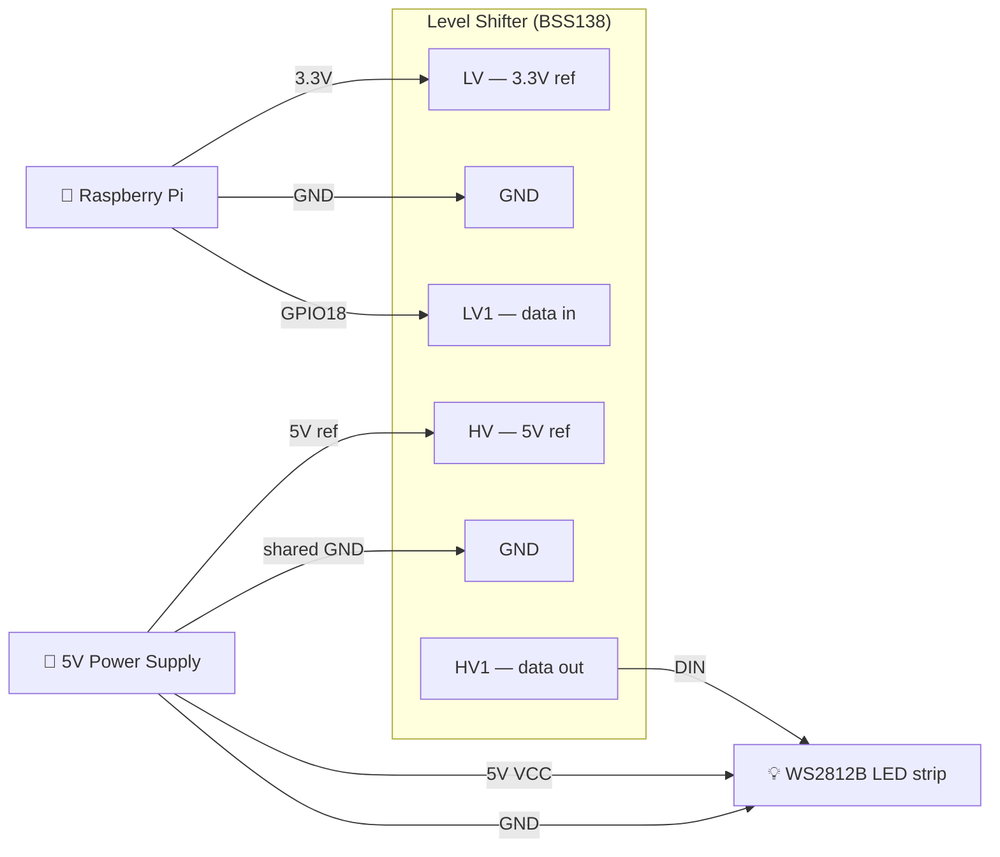

# LED Controller

A Rust web server for controlling WS2812B LED strips (NeoPixels) on a Raspberry Pi. Effects run in their own threads, transitions between effects are crossfaded, and everything is controllable from a browser.

## Features

- Web control panel: start, stop, next, effect picker, playlist management
- Smooth transitions: fade in on start, fade out on stop, crossfade when switching effects — each with a configurable duration (default 3 s)
- Sub-pixel antialiasing on all moving effects — point sources split brightness between adjacent LEDs for smooth, flicker-free motion
- Frame-rate independent animation — all effects scale by delta time, stable at any CPU load or speed setting
- Gamma correction — perceptual brightness LUT applied at hardware write (configurable exponent, default 2.2)
- Auto-advance: configurable per-effect play time before moving to the next playlist entry
- Full playlist management: add, remove, drag-to-reorder, shuffle; drag works on both desktop and mobile touch
- 23 built-in effects (see below)
- Each effect runs in its own OS thread
- Pluggable effect system — add a new effect in one file
- Persistent state — playlist, speed, brightness, gamma, color order, and all durations are saved to `led-state.json` and restored on restart
- Hardware settings configurable live from the web UI: GPIO pin, pixel count, color order, gamma
- WebSocket push — UI updates within one frame (~16 ms) on any state change; reconnects automatically
- Mobile-friendly UI — 44 px touch targets, pointer-event drag-to-reorder, always-visible controls on touch devices
- `NullPixels` dev mode (no hardware required) with debug logging
- Single binary deployment — no runtime dependencies on the target beyond the binary itself

## Changelog

**Current**
- WebSocket push replaces 500 ms polling — UI updates within one frame on any state change, with auto-reconnect
- Mobile-friendly UI — 44 px touch targets, pointer-event drag-to-reorder (works on touchscreens), always-visible remove buttons on touch devices
- Persist UI state (playlist, speed, brightness, gamma, color order, durations) across restarts via `led-state.json`
- GPIO pin, pixel count, color order, and gamma configurable live from the web UI
- Sub-pixel antialiasing on moving effects (Chase, Cylon, KITT, Meteor, Bouncing Balls) — point sources split brightness between adjacent LEDs
- Frame-rate independent decay — trail fades scale by delta time, stable at any speed setting
- Gamma correction LUT applied at hardware write (default 2.2, configurable)
- Software brightness slider (0–100%)
- Effect speed slider (0.1×–10×)
- Chase effect randomises colour on each lap
- Playlist loops back to index 0 at end
- Color channel order configurable via `--color-order` flag and web UI

**Initial release**
- Axum web server with REST API
- 23 built-in effects, each running in its own OS thread
- Smooth fade-in / fade-out / crossfade transitions with configurable durations
- Playlist management: add, remove, drag-to-reorder, shuffle, auto-advance
- `NullPixels` dev mode, cross-compilation via `build-pi.sh`

## Hardware

- Raspberry Pi (any model with GPIO)
- WS2812B / NeoPixel LED strip connected to **GPIO 18** (PWM0) by default
- The `rpi_ws281x` C library must be installed on the Pi:



```bash
sudo apt install -y build-essential cmake libclang-dev
git clone https://github.com/jgarff/rpi_ws281x
cd rpi_ws281x && mkdir build && cd build
cmake -D BUILD_SHARED=OFF -D BUILD_TEST=OFF ..
cmake --build .
sudo make install
```

## Running

### Development (no hardware)

```bash
cargo run
```

The server starts on `http://localhost:3000`. Pixel output is logged at `DEBUG` level, showing the first 6 pixel colors as hex on each frame:

```bash
RUST_LOG=led_controller=debug cargo run
```

### Cross-compiling for the Raspberry Pi

Use `build-pi.sh`, which wraps [`cross`](https://github.com/cross-rs/cross) (Docker-based cross compilation). `cross` handles the C toolchain needed for the `hardware` feature automatically.

**Prerequisites:**

```bash
cargo install cross
# Docker must be installed and running
```

**Build and deploy in one step:**

```bash
./build-pi.sh --deploy pi@raspberrypi.local
```

**Pass app flags through with `--`:**

```bash
./build-pi.sh --deploy pi@raspberrypi.local -- --pixels 144 --brightness 80
```

**Build only:**

```bash
./build-pi.sh
# binary at target/aarch64-unknown-linux-gnu/release/led-controller
```

**32-bit Raspberry Pi OS (Pi 2/3/4 running 32-bit):**

```bash
./build-pi.sh --target armv7-unknown-linux-gnueabihf --deploy pi@raspberrypi.local
```

**Dev build (NullPixels, no C library dependency):**

```bash
./build-pi.sh --no-hardware --deploy pi@raspberrypi.local
```

Script flags (before `--`):

| Flag | Default | Description |
|---|---|---|
| `--target <triple>` | `aarch64-unknown-linux-gnu` | Rust target triple |
| `--no-hardware` | off | Build without the hardware feature (NullPixels) |
| `--deploy user@host` | — | SCP the binary to the Pi after building |

### On the Raspberry Pi

Once the binary is deployed:

```bash
sudo ~/led-controller
```

`sudo` is required for GPIO/DMA access. The server listens on `0.0.0.0:3000` — open `http://<pi-ip>:3000` from any device on the network.

### Running as a systemd service

```ini
# /etc/systemd/system/leds.service
[Unit]
Description=LED Controller
After=network.target

[Service]
ExecStart=/home/pi/led-controller
WorkingDirectory=/home/pi
Restart=on-failure
User=root

[Install]
WantedBy=multi-user.target
```

```bash
sudo systemctl enable --now leds
```

State is written to `led-state.json` in `WorkingDirectory`, so the strip resumes exactly where it left off after a reboot or service restart.

## Configuration

Options are set via command-line flags. Most have saved-state equivalents — if the flag is omitted, the value from the last run is used. Explicit CLI flags always override saved state.

```
Usage: led-controller [OPTIONS]

Options:
      --pixels <PIXELS>                      Number of LEDs in the strip [default: 60, or saved]
      --gpio-pin <GPIO_PIN>                  GPIO pin number (hardware only) [default: 18, or saved]
      --brightness <BRIGHTNESS>              Hardware PWM brightness 0–255 [default: 25]
      --port <PORT>                          Port to listen on [default: 3000]
      --state-file <STATE_FILE>              Path to persist state across restarts [default: led-state.json]
      --fade-in-ms <FADE_IN_MS>              Fade-in duration in milliseconds [default: 3000, or saved]
      --fade-out-ms <FADE_OUT_MS>            Fade-out duration in milliseconds [default: 3000, or saved]
      --crossfade-ms <CROSSFADE_MS>          Crossfade duration in milliseconds [default: 3000, or saved]
      --effect-duration-ms <MS>              Time per effect before auto-advancing (0 = infinite) [default: 0, or saved]
      --color-order <COLOR_ORDER>            Physical color channel order (e.g. rgb, grb, bgr) [default: rgb, or saved]
      --speed <SPEED>                        Effect speed multiplier [default: 1.0, or saved]
      --brightness-scale <BRIGHTNESS_SCALE>  Software brightness scale 0.0–1.0 [default: 1.0, or saved]
      --gamma <GAMMA>                        Gamma correction exponent [default: 2.2, or saved]
  -h, --help                                 Print help
```

Example — 144-pixel strip on GPIO 12, 30 s per effect:

```bash
sudo ./led-controller --pixels 144 --gpio-pin 12 --brightness 80 --effect-duration-ms 30000
```

All settings (except `--brightness`, `--port`, and `--state-file`) can also be changed live from the web UI and are persisted automatically.

## State persistence

UI state is saved to `led-state.json` (or the path given by `--state-file`) whenever it changes. On restart the saved values are loaded automatically. The file is plain JSON and can be edited by hand.

What is persisted: playlist order and position, speed, software brightness, gamma, color order, all fade/transition durations, effect duration, GPIO pin, pixel count, and whether the strip was running.

Explicit CLI flags always override saved values for that session, but subsequent web UI changes will be saved over them.

## Web UI

Open `http://<pi-ip>:3000` in a browser.

| Section | Controls |
|---|---|
| **Status** | Coloured dot (green = running, amber = transitioning, grey = stopped) + current effect name |
| **Controls** | Start, Next, Stop |
| **Select Effect** | Dropdown of all registered effects + Play button to jump to it immediately |
| **Playlist** | Ordered list of effects to cycle through. Drag `⠿` to reorder, click `✕` to remove, click effect name to play it. Dropdown + **Add** to append any effect. **Shuffle** to randomise order. |
| **Speed** | Multiplier applied to every effect's time delta (0.1× – 4.0×, live) |
| **Brightness** | Software brightness scale applied to all pixel output (0–100%, live) |
| **Effect Duration** | How long each effect plays before auto-advancing (0 = manual only) |
| **Transition Durations** | Separate sliders for fade-in, crossfade, and fade-out |
| **Hardware Settings** | Color order (live), gamma (live), LED count and GPIO pin (apply button — reinitializes hardware) |

## Effects

| Effect | Description |
|---|---|
| Rainbow | Full-strip colour wheel sweep |
| Random Fade | Sparks that ignite and decay at random positions |
| Chase | Colour comet with antialiased fading tail; randomises colour on each lap |
| Sparkle | White twinkle with smooth per-pixel brightness transitions |
| Strobe / Strobe Red | Rapid flash burst followed by a pause |
| Cylon | Larson scanner — bright eye bouncing left↔right with a fading tail |
| KITT | Centre-outward Larson scanner |
| Halloween Eyes | Pair of glowing eyes that appear at a random position and fade out |
| Twinkle | Random pixels lit in a fixed colour |
| Random Twinkle | Random pixels each with a random colour |
| Snow Sparkle | Dim white background with bright white sparkles |
| Running Lights | Sine-wave brightness pattern chasing along the strip |
| Color Wipe Red/Green/Blue | Sequential pixel fill then clear, looping |
| Theatre Chase | Every 3rd pixel marching, theatre-marquee style |
| Theatre Chase Rainbow | Theatre chase with rainbow colour cycling |
| Fire | Realistic flame simulation with cooling and sparking physics |
| Bouncing Balls | Gravity-physics balls bouncing on a vertical strip |
| Meteor Rain | Meteor with antialiased head and glowing decaying tail |
| Solid Red/Green/Blue/White | Static solid colour |

## API

### `GET /ws` — WebSocket

Upgrades to a WebSocket connection. The server immediately sends the current state as a JSON text frame, then pushes an updated frame whenever any field changes (within one run-loop frame, ~16 ms). The connection is read-only — the server ignores any frames sent by the client.

Reconnect automatically on close; the server resends the full current state on each new connection.

### `GET /api/state`

```json
{
  "is_running": true,
  "current_effect": "Rainbow",
  "transition": "crossfading",
  "playlist": ["Rainbow", "Fire", "Meteor Rain"],
  "playlist_index": 1,
  "effects": ["Rainbow", "Random Fade", "Chase", "..."],
  "fade_in_ms": 3000,
  "fade_out_ms": 3000,
  "crossfade_ms": 3000,
  "effect_duration_ms": 30000,
  "speed": 1.0,
  "brightness": 1.0,
  "gamma": 2.2,
  "num_pixels": 60,
  "gpio_pin": 18,
  "color_order": "rgb"
}
```

`transition` is `"fading_in"`, `"fading_out"`, `"crossfading"`, or `null`.

### `POST /api/command`

```json
{ "action": "<action>", "effect": "<name>", "value_ms": 2000, "value": 1.5, "index": 0, "to_index": 3 }
```

| Action | Extra fields | Description |
|---|---|---|
| `start` | — | Start / resume from current playlist position |
| `stop` | — | Fade out and stop |
| `next` | — | Crossfade to the next effect in the playlist |
| `select` | `effect` | Crossfade to a named effect |
| `randomize` | — | Shuffle the playlist and restart from position 0 |
| `add_to_playlist` | `effect` | Append a named effect to the playlist |
| `remove_from_playlist` | `index` | Remove the effect at the given playlist position |
| `move_in_playlist` | `index`, `to_index` | Move a playlist item to a new position |
| `set_fade_in` | `value_ms` | Set fade-in duration |
| `set_fade_out` | `value_ms` | Set fade-out duration |
| `set_crossfade` | `value_ms` | Set crossfade duration |
| `set_effect_duration` | `value_ms` | Set per-effect play time (0 = infinite) |
| `set_speed` | `value` | Set speed multiplier (float, 0.1–10.0) |
| `set_brightness` | `value` | Set software brightness scale (float, 0.0–1.0) |
| `set_gamma` | `value` | Set gamma correction exponent (float, 1.0–4.0) |
| `set_color_order` | `effect` | Set physical channel order string (e.g. `"grb"`) |
| `set_num_pixels` | `value_ms` | Reinitialize with a new pixel count |
| `set_gpio_pin` | `value_ms` | Reinitialize hardware on a different GPIO pin |

## Adding an effect

1. Create `src/effects/myeffect.rs`:

```rust
use std::time::Duration;
use crate::effects::{Effect, Buffer};

pub struct MyEffect {
    time: f32,
}

impl MyEffect {
    pub fn new() -> Self { Self { time: 0.0 } }
}

impl Effect for MyEffect {
    fn name(&self) -> &'static str { "My Effect" }

    fn update(&mut self, buffer: &mut Buffer, delta: Duration) -> bool {
        self.time += delta.as_secs_f32();
        for pixel in buffer.iter_mut() {
            *pixel = [0, 0, 0]; // write RGB values
        }
        true // return false to signal natural completion
    }
}
```

Use `crate::effects::plot(buffer, pos, color, alpha)` for any moving point source — it splits brightness between adjacent LEDs by the fractional position for smooth antialiased motion. Use `crate::effects::fade_buffer(buffer, per_second, dt)` for trail decay that stays consistent across frame rates and speed settings.

2. Register it in `src/effects/mod.rs`:

```rust
pub mod myeffect;

pub fn default_registry(num_pixels: usize) -> EffectRegistry {
    let mut r = EffectRegistry::new();
    // ... existing effects ...
    r.register("My Effect", || Box::new(myeffect::MyEffect::new()));
    r
}
```

The effect appears in the web UI dropdown and playlist immediately.

## Project structure

```
src/
├── main.rs              entry point — parses CLI flags, wires Axum server and runner
├── pixels.rs            PixelStrip trait, NullPixels (dev), NeoPixelStrip (hardware), gamma LUT
├── runner.rs            effect thread management, fade/crossfade state machine, playlist,
│                        persistent state, hardware reinit factories
├── api.rs               Axum route handlers
└── effects/
    ├── mod.rs           Effect trait, EffectRegistry, plot/fade_buffer helpers, default_registry()
    ├── rainbow.rs       full-strip colour wheel sweep
    ├── fade.rs          random sparks that ignite and decay
    ├── chase.rs         colour comet with fading tail
    ├── sparkle.rs       white twinkle with smooth brightness
    ├── solid.rs         static solid colour
    ├── strobe.rs        rapid flash burst
    ├── cylon.rs         Larson scanner (Cylon + KITT variants)
    ├── halloween_eyes.rs glowing eyes that appear and fade
    ├── twinkle.rs       random pixel twinkle (fixed + random colour)
    ├── snow_sparkle.rs  dim background with bright sparkles
    ├── running_lights.rs sine-wave brightness chase
    ├── color_wipe.rs    sequential pixel fill
    ├── theatre_chase.rs theatre-marquee march (solid + rainbow)
    ├── fire.rs          flame simulation
    ├── bouncing_balls.rs gravity-physics bouncing balls
    └── meteor.rs        meteor with decaying tail
static/
├── index.html           control panel (embedded in binary via include_str!)
└── app.js               frontend JS (embedded in binary via include_str!)
led-state.json           persisted UI state (created automatically on first run)
```

## Roadmap / ideas

### UI / usability
- **Saved presets** — name and store a (effect + speed + brightness + duration) configuration to recall later
- **Dimming schedule** — automatically dim or turn off at a configured time (e.g. midnight), useful for permanent installs
- **Basic auth** — single username/password so the UI is not open to everyone on the local network

### Effects
- **Audio reactive** — sample a USB mic/dongle and drive brightness or color from beat detection or amplitude
- **Custom color picker** — choose the color for solid/wipe/chase effects from the UI without editing code
- **Per-effect color palette** — let effects draw from a user-chosen set of colors rather than hard-coded values
- **Segmented effects** — run different effects on different sections of the strip simultaneously

## Transition behavior

| Situation | Result |
|---|---|
| Start from stopped | Fade in from black over `fade_in_ms` |
| Stop while running | Fade out to black over `fade_out_ms` |
| Switch effects while running | Both effect threads run simultaneously; buffers are per-pixel lerped over `crossfade_ms` |
| Switch again mid-crossfade | Outgoing effect dropped; new effect crossfades from the current blended frame |
| Stop mid-crossfade | Incoming effect fades out from its current blend position |
| Effect duration expires | Auto-crossfade to next playlist entry; timer resets when effect reaches full Running state |
| Playlist reaches end | Wraps back to index 0 |
| GPIO pin or pixel count changed | Current effect stops, hardware reinitializes, effect restarts with new settings |
