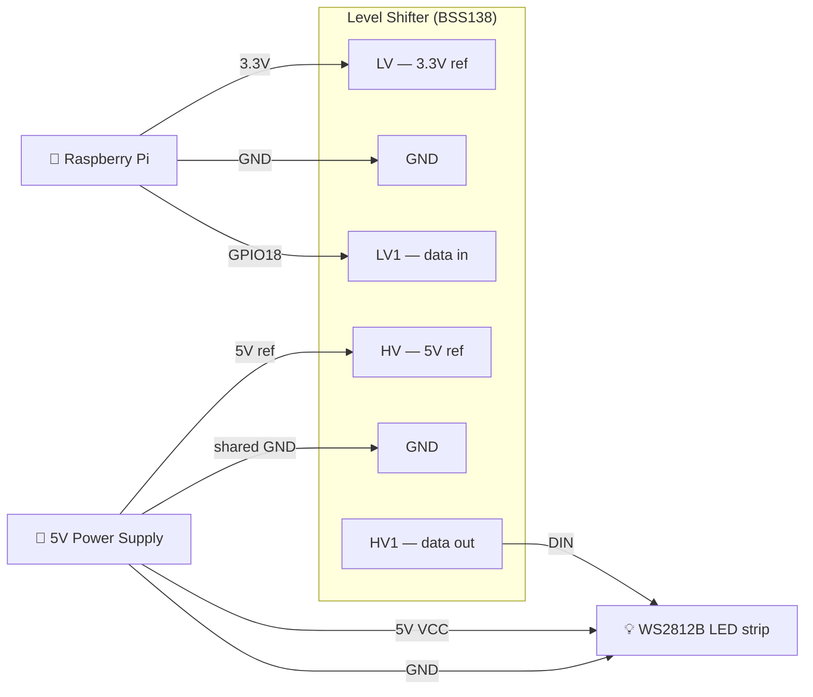

# LED Controller

A Rust web server for controlling WS2812B LED strips (NeoPixels) on a Raspberry Pi. Effects are written in Lua and hot-loaded at startup, transitions between effects are crossfaded, and everything is controllable from a browser — including on a phone pinned to the home screen.

## Features

- Web control panel: start, stop, next, rich effect picker with live search and per-effect descriptions, playlist management
- **96 effects** — all written in Lua, loaded from the `effects/` directory at startup
- Lua effect system — add or edit effects without recompiling; any `.lua` file in `effects/` is registered automatically
- Smooth transitions: fade in on start, fade out on stop, crossfade when switching effects — each with a configurable duration (default 3 s)
- Sub-pixel antialiasing on all moving effects — point sources split brightness between adjacent LEDs for smooth, flicker-free motion
- Frame-rate independent animation — all effects scale by delta time, stable at any CPU load or speed setting
- Gamma correction — perceptual brightness LUT applied at hardware write (configurable exponent, default 2.2)
- Auto-advance: configurable per-effect play time before moving to the next playlist entry
- Full playlist management: add, remove, drag-to-reorder, shuffle; drag works on both desktop and mobile touch
- Per-effect descriptions shown in the effect picker — each effect file declares a `description` string
- Status box shows current effect name, play timer (updated every second), and achieved FPS (updated every 5 s)
- Graceful shutdown — SIGINT/SIGTERM triggers a 500 ms fade to black before exiting
- Persistent state — playlist, speed, brightness, gamma, color order, all durations, palette, and audio settings saved to `led-state.json` and restored on restart
- Hardware settings configurable live from the web UI: GPIO pin, pixel count, color order, gamma
- WebSocket push — UI updates within one frame (~16 ms) on any state change; reconnects automatically
- Mobile-friendly UI — 44 px touch targets, pointer-event drag-to-reorder, always-visible controls on touch devices
- `NullPixels` dev mode (no hardware required) with debug logging
- Single binary deployment — Lua VM is vendored; no runtime dependencies on the target beyond the binary and the `effects/` directory
- **Color palette cycling** — up to 8 swatches cycle at a configurable rate (0.5 s – 30 s per color); available to Lua as `COLOR_R/G/B` and `PALETTE[i]`
- **Audio reactive** — capture from any system input device; exposes amplitude, beat envelope, bass/mid/high bands, a 16-band spectrum, and detected BPM to every Lua effect
- **Audio input gain** — post-normalization multiplier to match sensitivity without touching the system mixer
- **BPM detection + tap tempo** — rolling inter-beat average shown in the UI; manual tap locks the beat clock to a precise tempo; exposed as `AUDIO_BPM` in Lua
- **Per-band EQ** — 16 independent gain sliders (one per frequency band, 20 Hz – 16 kHz) to boost or cut specific ranges
- **Real-time spectrum visualizer** — 16-band bar graph updates at ~10 fps in the Audio Input card
- **Simulated strip preview** — canvas element shows pixel colors at ~15 fps in the browser (works without hardware)
- **PWA / installable** — `manifest.json` + pass-through service worker; "Add to Home Screen" on Android and iOS

## Changelog

**Current**
- Simulated strip preview: full-width canvas renders pixel colors at ~15 fps between the Controls and Effect Selector cards, driven by WebSocket pixel data (no hardware required to see effects)
- Effect picker preview buttons: each row gets a `▶` button (visible on hover) that plays the effect immediately without closing the picker, so you can browse effects and see them live on the canvas strip
- PWA support: `manifest.json`, SVG icons, pass-through service worker; Android/Chrome shows an install prompt and iOS supports Add to Home Screen
- BPM detection from rolling inter-beat intervals; exposed as `AUDIO_BPM` Lua global and `audio_bpm` in WebSocket state
- Tap tempo: clicking Tap ≥ 3 times locks the beat clock; ✕ clears it; locked BPM drives beat generation directly in the audio thread
- Per-band EQ: 16 independent gain sliders (20 Hz – 16 kHz) in a new Audio EQ card; applied after per-band normalization, persisted across restarts
- Spectrum visualizer: 16-bar gradient strip in the Audio Input card, pushed via WebSocket at ~10 fps
- Audio input gain control: post-normalization multiplier slider (×0.1–×5.0), persisted

**v0.6**
- Rich custom effect picker replaces the native select — each option shows the effect name on one line and the full description on a second dimmed line; a live search/filter field narrows the list
- ALSA audio device names cleaned up in the dropdown — `CARD=` name is extracted, ambiguous duplicates are disambiguated with a type suffix (hw, plug, sysdefault, etc.)
- Color palette cycling — single `COLOR_R/G/B` selector replaced by palette cycle speed slider; `COLOR_R/G/B` now steps through palette colors at the configured rate, synchronized across all Lua VMs

**v0.5**
- 12 additional audio reactive effects (96 total): Beat Bounce, Beat Confetti, Beat Comet, Spectrum Waterfall, Frequency Comets, Harmonic Rings, Audio Fire, Audio Twinkle, Crowd Surf, Bass Treble Split, Audio Plasma, Spectrum Snake
- Static files are embedded in the binary at compile time — rebuild (`cargo run --features audio`) to pick up HTML/JS changes

**v0.4**
- Audio reactive effects: USB mic or any system input device selectable from the web UI; device list refreshable without restart; VU meter and beat indicator in the UI
- Exposes `AUDIO_AMP`, `AUDIO_BEAT`, `AUDIO_BASS`, `AUDIO_MID`, `AUDIO_HIGH`, `AUDIO_SPECTRUM[16]` as Lua globals, updated every frame
- First audio effects: Audio Pulse, Audio Beat Flash, Audio Spectrum
- `audio` Cargo feature — `cpal` and `rustfft` are optional; dev builds on macOS compile without them; Pi builds enable with `--features audio`
- `Cross.toml` — installs `libasound2-dev:arm64` in the cross-compilation container for ALSA support

**v0.3**
- 81 effects, all running as Lua scripts loaded from `effects/` at startup
- Lua effect system: hot-load effects without recompiling; each file exports `name`, `description`, `init(n)`, and `update(buf, dt)`
- Per-effect color palette — up to 8 swatches configurable in the web UI; available as `PALETTE[i]` and `PALETTE_SIZE` in every Lua effect; initialized to 5 evenly-spaced random hues on startup
- Status box: live play timer (resets on effect change) and FPS counter
- Graceful shutdown: SIGINT/SIGTERM fades the strip to black over 500 ms before the process exits

**v0.2**
- WebSocket push replaces 500 ms polling — UI updates within one frame on any state change, with auto-reconnect
- Mobile-friendly UI — 44 px touch targets, pointer-event drag-to-reorder, always-visible remove buttons on touch devices
- Persist UI state (playlist, speed, brightness, gamma, color order, durations) across restarts via `led-state.json`
- GPIO pin, pixel count, color order, and gamma configurable live from the web UI
- Sub-pixel antialiasing on moving effects; frame-rate-independent trail decay; gamma correction LUT

**v0.1**
- Axum web server with REST API
- 23 built-in effects, each running in its own OS thread
- Smooth fade-in / fade-out / crossfade transitions with configurable durations
- Playlist management: add, remove, drag-to-reorder, shuffle, auto-advance
- `NullPixels` dev mode, cross-compilation via `build-pi.sh`

## Hardware

- Raspberry Pi (any model with GPIO)
- WS2812B / NeoPixel LED strip connected to **GPIO 18** (PWM0) by default
- The `rpi_ws281x` C library must be installed on the Pi:



```bash
sudo apt install -y build-essential cmake libclang-dev
git clone https://github.com/jgarff/rpi_ws281x
cd rpi_ws281x && mkdir build && cd build
cmake -D BUILD_SHARED=OFF -D BUILD_TEST=OFF ..
cmake --build .
sudo make install
```

## Running

### Development (no hardware)

```bash
cargo run
```

The server starts on `http://localhost:3000`. Pixel output is logged at `DEBUG` level, showing the first 6 pixel colors as hex on each frame:

```bash
RUST_LOG=led_controller=debug cargo run
```

### Cross-compiling for the Raspberry Pi

Use `build-pi.sh`, which wraps [`cross`](https://github.com/cross-rs/cross) (Docker-based cross compilation). `cross` handles the C toolchain needed for the `hardware` feature automatically. `Cross.toml` adds the ALSA headers needed for the `audio` feature.

**Prerequisites:**

```bash
cargo install cross
# Docker must be installed and running
```

**Build and deploy in one step:**

```bash
./build-pi.sh --deploy pi@raspberrypi.local
```

**With audio reactive support:**

```bash
./build-pi.sh --features audio --deploy pi@raspberrypi.local
```

**Pass app flags through with `--`:**

```bash
./build-pi.sh --deploy pi@raspberrypi.local -- --pixels 144 --brightness 80
```

**Build only:**

```bash
./build-pi.sh
# binary at target/aarch64-unknown-linux-gnu/release/led-controller
```

**32-bit Raspberry Pi OS (Pi 2/3/4 running 32-bit):**

```bash
./build-pi.sh --target armv7-unknown-linux-gnueabihf --deploy pi@raspberrypi.local
```

**Dev build (NullPixels, no C library dependency):**

```bash
./build-pi.sh --no-hardware --deploy pi@raspberrypi.local
```

Script flags (before `--`):

| Flag | Default | Description |
|---|---|---|
| `--target <triple>` | `aarch64-unknown-linux-gnu` | Rust target triple |
| `--no-hardware` | off | Build without the hardware feature (NullPixels) |
| `--features <list>` | — | Extra Cargo features (e.g. `audio`) |
| `--deploy user@host` | — | SCP the binary to the Pi after building |

### On the Raspberry Pi

Once the binary and the `effects/` directory are deployed:

```bash
sudo ~/led-controller
```

`sudo` is required for GPIO/DMA access. The server listens on `0.0.0.0:3000` — open `http://<pi-ip>:3000` from any device on the network.

The `effects/` directory must be present in the working directory (or pass `--effects-dir` to specify a different path).

### Running as a systemd service

```ini
# /etc/systemd/system/leds.service
[Unit]
Description=LED Controller
After=network.target

[Service]
ExecStart=/home/pi/led-controller
WorkingDirectory=/home/pi
Restart=on-failure
User=root

[Install]
WantedBy=multi-user.target
```

```bash
sudo systemctl enable --now leds
```

State is written to `led-state.json` in `WorkingDirectory`, so the strip resumes exactly where it left off after a reboot or service restart. Copy the `effects/` directory alongside the binary.

## Configuration

Options are set via command-line flags. Most have saved-state equivalents — if the flag is omitted, the value from the last run is used. Explicit CLI flags always override saved state.

```
Usage: led-controller [OPTIONS]

Options:
      --pixels <PIXELS>                      Number of LEDs in the strip [default: 60, or saved]
      --gpio-pin <GPIO_PIN>                  GPIO pin number (hardware only) [default: 18, or saved]
      --brightness <BRIGHTNESS>              Hardware PWM brightness 0–255 [default: 25]
      --port <PORT>                          Port to listen on [default: 3000]
      --state-file <STATE_FILE>              Path to persist state across restarts [default: led-state.json]
      --fade-in-ms <FADE_IN_MS>              Fade-in duration in milliseconds [default: 3000, or saved]
      --fade-out-ms <FADE_OUT_MS>            Fade-out duration in milliseconds [default: 3000, or saved]
      --crossfade-ms <CROSSFADE_MS>          Crossfade duration in milliseconds [default: 3000, or saved]
      --effect-duration-ms <MS>             Time per effect before auto-advancing (0 = infinite) [default: 0, or saved]
      --color-order <COLOR_ORDER>            Physical color channel order (e.g. rgb, grb, bgr) [default: rgb, or saved]
      --speed <SPEED>                        Effect speed multiplier [default: 1.0, or saved]
      --brightness-scale <BRIGHTNESS_SCALE>  Software brightness scale 0.0–1.0 [default: 1.0, or saved]
      --gamma <GAMMA>                        Gamma correction exponent [default: 2.2, or saved]
      --effects-dir <EFFECTS_DIR>            Directory to scan for Lua effect scripts [default: effects]
  -h, --help                                 Print help
```

Example — 144-pixel strip on GPIO 12, 30 s per effect:

```bash
sudo ./led-controller --pixels 144 --gpio-pin 12 --brightness 80 --effect-duration-ms 30000
```

All settings (except `--brightness`, `--port`, and `--state-file`) can also be changed live from the web UI and are persisted automatically.

## State persistence

UI state is saved to `led-state.json` (or the path given by `--state-file`) whenever it changes. On restart the saved values are loaded automatically. The file is plain JSON and can be edited by hand.

What is persisted: playlist order and position, speed, software brightness, gamma, color order, all fade/transition durations, effect duration, GPIO pin, pixel count, whether the strip was running, palette colors and cycle speed, audio device, audio input gain, and per-band EQ gains.

Explicit CLI flags always override saved values for that session, but subsequent web UI changes will be saved over them.

## Web UI

Open `http://<pi-ip>:3000` in a browser. On Android/Chrome an install prompt appears; on iOS use Share → Add to Home Screen.

| Section | Controls |
|---|---|
| **Status** | Coloured dot (green = running, amber = transitioning, grey = stopped) + current effect name + play timer + FPS |
| **Controls** | Start, Next, Stop |
| **Strip Preview** | Full-width canvas showing live pixel colors at ~15 fps — works without hardware via `NullPixels` |
| **Select Effect** | Searchable picker; each row shows name + description. `▶` button (hover to reveal) previews the effect immediately on the strip without closing the picker. **Play** commits and closes. |
| **Playlist** | Ordered list of effects to cycle through. Drag `⠿` to reorder, click `✕` to remove. Dropdown + **Add** to append; **Shuffle** to randomise; **Add All Effects** fills the playlist. |
| **Speed** | Multiplier applied to every effect's time delta (0.1× – 10.0×, live) |
| **Brightness** | Software brightness scale applied to all pixel output (0–100%, live) |
| **Palette** | Up to 8 color swatches — injected as `COLOR_R/G/B` (cycling), `PALETTE[i]`, and `PALETTE_SIZE` into every Lua effect each frame. Cycle speed slider controls how long each color is held (0.5 s – 30 s). |
| **Audio Input** | Device dropdown + refresh button; VU meter; 16-band spectrum bars; beat dot; BPM display with Tap / ✕ buttons; input gain slider |
| **Audio EQ** | 16 compact sliders (20 Hz – 16 kHz) for per-band gain (0×–4×); Reset button; persisted |
| **Effect Duration** | How long each effect plays before auto-advancing (0 = manual only) |
| **Transition Durations** | Separate sliders for fade-in, crossfade, and fade-out |
| **Hardware Settings** | Color order (live), gamma (live), LED count and GPIO pin (apply button — reinitializes hardware) |

## Effects

All 96 effects are Lua scripts in the `effects/` directory.

| Effect | Description |
|---|---|
| 🎵 Audio Pulse | Whole strip pulses with audio amplitude; color is a real-time mix of bass (red), mid (green), and high (blue) |
| 🥁 Audio Beat Flash | Flashes white on each detected beat over a slowly hue-cycling color background |
| 🔆 Audio Fire | Fire simulation driven by audio — silence leaves cold embers, loud peaks drive flames to the tips, and beats send explosive flares |
| 🫀 Audio Plasma | Plasma interference pattern whose four wave frequencies are modulated in real-time by spectrum bands |
| 🎸 Audio Spectrum | Displays the 16-band frequency spectrum as a bar graph — bass on the left, treble on the right |
| 💎 Audio Twinkle | Stars spawn at a rate proportional to amplitude; beats send a white flash that fades back to the starfield |
| 🎚️ Bass Treble Split | Left half pulses warm red/orange with bass; right half shimmers cool blue/white with treble; split point slides with mid energy |
| 🏀 Beat Bounce | Balls launch from both ends of the strip on each beat; harder hits mean faster balls |
| 🎉 Beat Confetti | On each beat a burst of colorful dots scatter from a random position and drift outward |
| 🛸 Beat Comet | A bright comet launches on each beat — harder hits make faster comets with longer trails |
| 🏄 Crowd Surf | Particles drift lazily at silence; loud audio multiplies and speeds them up; beats reverse all particles simultaneously |
| 🎠 Frequency Comets | Three comets orbit the strip — bass (red), mid (green), treble (blue); each brightens and accelerates when its band is active |
| 🎶 Harmonic Rings | 16 sine waves layered additively — each wave's amplitude tracks its frequency band; the superposition morphs with the music |
| 🐉 Spectrum Snake | A snake speeds up on each beat and shifts color toward the dominant frequency band |
| 🌊 Spectrum Waterfall | The frequency spectrum scrolls as a color history — newest slice on the left, bass=red, mid=green, treble=blue |
| 🌌 Aurora | Four overlapping sine-wave bands of green, teal, blue, and purple shimmer at independent speeds |
| 🦑 Bioluminescence | Deep ocean darkness with expanding blue-green pulses, like disturbed bioluminescent plankton |
| 🌸 Bloom | Rings of color bloom outward from random seed points and fade |
| 🎱 Bouncing Balls | Three balls (red, green, blue) bounce under simulated gravity with energy loss on each bounce |
| 🫁 Breathing | All pixels pulse in and out on a slow breathing rhythm using a sin² envelope |
| 🦋 Breathing Rainbow | Rainbow colors sweep through the strip while a breathing pulse slowly expands and contracts |
| 🕯️ Candlelight | Warm orange flicker: each pixel drifts toward a random brightness target, with occasional sharp gusts |
| 🧩 Cellular Automata | Rule 30 cellular automaton; complex patterns emerge each generation from a simple 3-cell neighborhood rule |
| 💨 Chase | Antialiased comet with a tail proportional to strip length; picks a new random color each lap |
| 🎄 Christmas | Alternating red and green bands with a slow white twinkle overlay |
| 🌀 Color Cycle | The whole strip slowly cycles through one solid hue at a time |
| 🖌️ Color Wipe | Fills the strip with the current palette color one pixel at a time from one end, then clears it the same way |
| 🌠 Comets | Three comets of different colors chase each other around the strip at different speeds |
| 🎊 Confetti | Saturated random-hue dots scatter onto a slowly decaying background |
| 👁️ Cylon | Red Larson-scanner eye bounces back and forth with exponential brightness falloff on either side |
| 🧬 DNA Helix | Two interlocked sine waves in cyan and orange scroll along the strip like a DNA double helix |
| 🎲 Domino | A tap at one end triggers a chain reaction that cascades to the other end, each pixel tipping the next |
| ⚙️ Double Pendulum | Chaotic double-pendulum physics — the tip traces an unpredictable path with a fading color trail |
| 💧 Drip | Colored drops spawn at one end, accelerate under gravity, and splat at the other end |
| 🐣 Easter | Soft pastel mint, lavender, peach, sky blue, and rose pink breathe gently across the strip |
| 🔥 Fire | Heat-diffusion simulation: base glows hot, heat rises through a black→red→yellow→white palette |
| 🪲 Fireflies | Dim drifting dots that randomly glow bright then fade, like fireflies on a summer night |
| 💥 Fireworks | Rockets launch from the base, reach an apex, and burst into colorful fragments |
| 🔭 Galaxy | Soft drifting nebula of blues and purples with occasional bright star flares |
| 📺 Glitch | Digital corruption — block shifts, channel swaps, noise bursts, and color inversions |
| 🌅 Gradient Cycle | Smooth gradient between two complementary colors that slowly scrolls across the strip |
| 🪐 Gravity Well | Particles orbit a drifting gravity center — closer ones orbit faster and glow brighter |
| 🎃 Halloween Eyes | A pair of red eyes appears at a random position, holds, fades out, then reappears elsewhere |
| 💓 Heartbeat | A red lub-dub double pulse at 72 BPM with a long dark pause between beats |
| 💫 Hypnotic Spiral | Rotating color bands create a hypnotic optical illusion |
| 🧊 Icicles | Ice crystals grow from anchor points, drip, and shatter on impact |
| 🤹 Juggle | Six differently-colored dots bounce at staggered speeds; their fading trails overlap and blend |
| 🚗 KITT | Twin red eyes start at center, expand outward to the ends, then contract back together |
| 🌋 Lava Lamp | Slow warm blobs drift through a dim red background, like a lava lamp |
| 🌩️ Lightning | Random white strikes flare across the strip, then fade into a flickering blue-white afterglow |
| 📐 Lissajous | Parametric Lissajous figure mapped to the strip — brightness shows the curve density at each position |
| 💻 Matrix Rain | Green falling pixel trails cascade along the strip like The Matrix |
| ☄️ Meteor Rain | White meteor streaks across the strip leaving a randomly-decaying trail, then resets |
| 📡 Morse Code | Flashes "SOS" in International Morse Code on a repeating loop |
| 🐦 Murmuration | Boids flocking — particles attract, align, and avoid each other in flight |
| 💡 Neon Sign | Pink neon glow with realistic fluorescent tube flicker, buzz, and occasional dropout |
| 🏔️ Northern Lights | Slow curtains of aurora light drift across the strip in structured beams |
| 🫧 Oil Slick | Dark iridescent rainbow sheen slowly shifts across the strip like light on spilled oil |
| 🌊 Pacifica | Three-layer ocean wave simulation in deep blue-green, inspired by FastLED's Pacifica |
| ⏳ Pendulum | A glowing dot swings with realistic pendulum physics, slowing at each end |
| 🎯 Pendulum Wave | Multiple pendulums with slightly different periods create mesmerizing wave patterns |
| 🔢 Pixel Sort | Bubble sort visualized — hued pixels shuffle into chromatic order, then reset |
| 🔮 Plasma | Four sine waves at different spatial and temporal frequencies combine into a shifting color interference pattern |
| 🚨 Police Lights | Alternating red/blue half-strip strobes with a brief white center flash between each side |
| 🏓 Pong | A bright dot bounces between the two ends, getting faster with each hit |
| 🍿 Popcorn | Pixels pop bright then fade; spawn rate ramps up in waves like corn popping |
| 🏳️‍🌈 Pride | Six-color pride flag mapped across the strip and slowly scrolling |
| 🌈 Rainbow | Colorwheel hue shifts pixel-to-pixel across the strip, cycling through all colors continuously |
| 🎆 Random Fade | Sparks of random color ignite at random positions, ramp up to peak brightness, then fade out |
| 🎨 Random Twinkle | Ten random-colored pixels reposition randomly every 100 ms |
| 🧪 Reaction Diffusion | Gray-Scott activator-inhibitor model; organic Turing stripe patterns emerge from chemistry |
| 💦 Ripple | Random tap points send expanding rings of light that fade as they travel outward |
| 🏃 Running Lights | Red sine-wave brightness ripples continuously down the strip |
| 🏖️ Sand | Sandy particles settle under gravity, then scatter with a periodic shake |
| 〰️ Sinelon | A single dot rides a sine wave back and forth leaving a fading trail |
| 🐍 Snake | Classic snake grows as it eats food items, bouncing between the strip ends |
| ❄️ Snow Sparkle | Dim white background with a single bright sparkle that jumps to a new position every 200 ms |
| 🎨 Solid Color | Strip fills with the current `COLOR_R/G/B` palette cycling color |
| ✨ Sparkle | Pixels independently ramp to a random peak brightness then fade back to dark |
| 🎇 Sparkler | A drifting source continuously throws fast short-lived sparks in both directions |
| 🌟 Starfield | Stars at varying depths scroll past — nearer ones brighter and faster |
| ⚡ Strobe | Ten rapid white flashes in a burst followed by a 1-second pause, then repeat |
| 🌄 Sunrise | Slow day cycle shifting through night purple, deep red, orange, golden yellow, and back |
| 🎭 Theatre Chase | Every third pixel is lit and steps along the strip in a marching-lights pattern |
| 🎪 Theatre Chase Rainbow | Theatre chase with a different colorwheel hue on each lit pixel, advancing with every step |
| ⛈️ Thunderstorm | Rain drops fall under gravity while periodic lightning flashes illuminate the whole strip |
| 🚦 Traffic | Colored cars travel in both directions with headlights and taillights; collisions flash orange |
| ⚖️ Tug of War | Red and blue forces push from opposite ends; the boundary oscillates and occasionally surges |
| ⭐ Twinkle | Ten white pixels reposition randomly every 100 ms |
| 🌪️ Twister | Multiple overlapping sine waves at different frequencies create shifting interference patterns |
| ⌨️ Typewriter | Pixels illuminate left-to-right like text being typed, pause, then erase right-to-left |
| 🦠 Virus | Infection seeds spread outward to neighbors, color shifts green→red as it ages, then resets |
| 📊 VU Meter | Simulated audio level meter with a bouncing bar, green-to-red color gradient, and peak-hold pixel |
| 🫗 Waterfall | A stream of slowly-shifting color flows steadily from one end to the other |
| 〽️ Wave Interference | Sine-wave sources drift toward each other; constructive and destructive interference shifts patterns |
| 🐛 Worm | A glowing segmented worm crawls the strip; speed variation makes the body snake and bunch |

## Lua effect API

Each `.lua` file in `effects/` is auto-discovered at startup. A file must define:

```lua
name        = "My Effect"          -- display name in UI
description = "One-line summary"   -- shown in the effect picker

function init(n)       -- called once; n = pixel count
    -- set up local state here
end

function update(buf, dt)  -- called every frame; dt = seconds since last frame
    -- write pixels, return true to keep running
    return true
end
```

### Buffer methods

| Method | Description |
|---|---|
| `buf:len()` | Number of pixels |
| `buf:set(i, r, g, b)` | Set pixel `i` (0-based) to exact RGB |
| `buf:get(i)` → `r, g, b` | Read current pixel value |
| `buf:clear()` | Set all pixels to black |
| `buf:plot(pos, r, g, b, alpha)` | Sub-pixel antialiased write at fractional position (wraps via `rem_euclid`) |
| `buf:fade(per_second, dt)` | Multiply all pixels by `per_second ^ dt` — frame-rate-independent trail decay |

### Globals injected every frame

All globals are 0 / empty when the corresponding feature is inactive (no device selected, no palette configured).

| Global | Type | Description |
|---|---|---|
| `COLOR_R`, `COLOR_G`, `COLOR_B` | integer 0–255 | Current palette color, cycling at the configured rate (synchronized across all Lua VMs) |
| `PALETTE` | table | 1-indexed table; each entry is `{r, g, b}` (integers 0–255) |
| `PALETTE_SIZE` | integer | Number of colors currently in the palette (0 if empty) |
| `AUDIO_AMP` | float 0–1 | Smoothed RMS amplitude (auto-gain normalized to recent peak, then scaled by input gain) |
| `AUDIO_BEAT` | float 0–1 | Beat envelope — spikes to 1.0 on each detected beat, decays ~150 ms half-life |
| `AUDIO_BASS` | float 0–1 | Normalized energy in 20–200 Hz |
| `AUDIO_MID` | float 0–1 | Normalized energy in 200 Hz – 4 kHz |
| `AUDIO_HIGH` | float 0–1 | Normalized energy in 4–20 kHz |
| `AUDIO_SPECTRUM` | table[16] | 1-indexed; 16 log-spaced bands from 20 Hz to 20 kHz, each 0–1 (after per-band EQ gain) |
| `AUDIO_BPM` | float | Detected or tap-locked BPM (0 when unknown) |

```lua
-- Cycle through palette colors manually
local c = PALETTE[(math.floor(t) % PALETTE_SIZE) + 1]

-- Beat flash
local flash = math.floor((AUDIO_BEAT or 0) * 255)

-- BPM-synced pulse (fires once per beat)
local beat_phase = (t * (AUDIO_BPM / 60)) % 1.0

-- Spectrum bar for band i (1–16)
local level = AUDIO_SPECTRUM and AUDIO_SPECTRUM[i] or 0
```

`buf:plot` splits brightness between the two adjacent integer pixels by the fractional part, giving smooth motion without pixel-level jitter. `buf:fade` keeps trail lengths consistent regardless of frame rate or speed setting — use `0.85^60` to mean "decay to 85% at 60 fps per frame".

### Adding an effect

1. Create `effects/my_effect.lua` with the template above.
2. Restart the server (or redeploy the `effects/` directory).

The effect appears in the web UI dropdown automatically. No Rust code changes needed.

## API

### `GET /ws` — WebSocket

Upgrades to a WebSocket connection. The server immediately sends the current state as a JSON text frame, then pushes an updated frame whenever any field changes (within one run-loop frame, ~16 ms). Pixel data is pushed at ~15 fps whenever effects are running. The connection is read-only — the server ignores any frames sent by the client.

Reconnect automatically on close; the server resends the full current state on each new connection.

### `GET /api/state`

```json
{
  "is_running": true,
  "current_effect": "Rainbow",
  "transition": null,
  "playlist": ["Rainbow", "Fire", "Meteor Rain"],
  "playlist_index": 0,
  "effects": ["Rainbow", "Random Fade", "Chase", "..."],
  "effect_descriptions": { "Rainbow": "Full-strip colour wheel sweep" },
  "effect_elapsed_secs": 42,
  "fps": 59.8,
  "fade_in_ms": 3000,
  "fade_out_ms": 3000,
  "crossfade_ms": 3000,
  "effect_duration_ms": 0,
  "speed": 1.0,
  "brightness": 1.0,
  "gamma": 2.2,
  "num_pixels": 60,
  "gpio_pin": 18,
  "color_order": "rgb",
  "palette_cycle_ms": 5000,
  "palette": [[255,0,0],[0,255,0],[0,0,255]],
  "audio_devices": ["Built-in Microphone", "USB Audio Device"],
  "audio_device": "USB Audio Device",
  "audio_amplitude": 0.42,
  "audio_beat": 0.87,
  "audio_gain": 1.5,
  "audio_bpm": 124.0,
  "audio_bpm_locked": false,
  "audio_spectrum": [0.8, 0.6, 0.4, 0.3, 0.2, 0.1, 0.1, 0.05, 0.05, 0.03, 0.02, 0.01, 0.01, 0.0, 0.0, 0.0],
  "audio_band_gains": [1.0, 1.0, 1.2, 1.0, 1.0, 1.0, 1.0, 1.0, 1.0, 1.0, 1.0, 1.0, 0.8, 0.8, 0.8, 0.8],
  "pixel_data": [[255,0,0],[128,0,0],[0,0,0]]
}
```

`transition` is `"fading_in"`, `"fading_out"`, `"crossfading"`, or `null`. `pixel_data` contains one `[r,g,b]` entry per LED, updated at ~15 fps when effects are running.

### `POST /api/command`

```json
{ "action": "<action>", "effect": "<name>", "value_ms": 2000, "value": 1.5, "index": 0, "to_index": 3 }
```

| Action | Extra fields | Description |
|---|---|---|
| `start` | — | Start / resume from current playlist position |
| `stop` | — | Fade out and stop |
| `next` | — | Crossfade to the next effect in the playlist |
| `select` | `effect` | Crossfade to a named effect |
| `randomize` | — | Shuffle the playlist and restart from position 0 |
| `add_to_playlist` | `effect` | Append a named effect to the playlist |
| `add_all_to_playlist` | — | Append every registered effect to the playlist |
| `remove_from_playlist` | `index` | Remove the effect at the given playlist position |
| `move_in_playlist` | `index`, `to_index` | Move a playlist item to a new position |
| `clear_playlist` | — | Remove all items from the playlist |
| `set_fade_in` | `value_ms` | Set fade-in duration |
| `set_fade_out` | `value_ms` | Set fade-out duration |
| `set_crossfade` | `value_ms` | Set crossfade duration |
| `set_effect_duration` | `value_ms` | Set per-effect play time (0 = infinite) |
| `set_speed` | `value` | Set speed multiplier (float, 0.1–10.0) |
| `set_brightness` | `value` | Set software brightness scale (float, 0.0–1.0) |
| `set_gamma` | `value` | Set gamma correction exponent (float, 1.0–4.0) |
| `set_color_order` | `effect` | Set physical channel order string (e.g. `"grb"`) |
| `set_num_pixels` | `value_ms` | Reinitialize with a new pixel count |
| `set_gpio_pin` | `value_ms` | Reinitialize hardware on a different GPIO pin |
| `set_palette` | `palette` | Set the palette — array of `{"r":…,"g":…,"b":…}` objects (max 8) |
| `set_palette_cycle_ms` | `value_ms` | Set how long each palette color is held (ms) |
| `set_audio_device` | `effect` | Start capturing from the named device (`null` or omit to stop) |
| `refresh_audio_devices` | — | Re-enumerate input devices and update `audio_devices` in state |
| `set_audio_gain` | `value` | Set audio input gain multiplier (float, 0.1–5.0) |
| `tap_tempo` | — | Record a tap; BPM is locked after ≥ 3 taps within 3 s of each other |
| `clear_tap_tempo` | — | Clear the tap-locked BPM; revert to auto-detection |
| `set_band_gain` | `index`, `value` | Set EQ gain for band `index` (0–15); float, 0.0–4.0 |

## Project structure

```
src/
├── main.rs              entry point — CLI flags, Axum routes, graceful shutdown
├── pixels.rs            PixelStrip trait, NullPixels (dev), NeoPixelStrip (hardware), gamma LUT
├── audio.rs             AudioAnalysis shared state (amplitude, beat, BPM, band gains, spectrum),
│                        AudioHandle RAII, list_input_devices / start_audio
│                        (compiled only with --features audio; stubs otherwise)
├── runner.rs            effect thread management, fade/crossfade state machine, playlist,
│                        persistent state, hardware reinit factories, audio handle lifecycle,
│                        pixel snapshot for strip preview
├── api.rs               Axum route handlers (HTML, JS, manifest, icons, service worker, WS, REST)
└── effects/
    ├── mod.rs           Effect trait, EffectRegistry (with Lua auto-load)
    └── lua_effect.rs    LuaEffect wrapper — Lua VM per effect, globals injection, probe_metadata
effects/                 96 Lua effect scripts (auto-discovered at startup)
static/
├── index.html           control panel (embedded in binary via include_str!)
├── app.js               frontend JS (embedded in binary via include_str!)
├── manifest.json        PWA manifest
├── icon.svg             app icon (LED strip motif)
├── icon-maskable.svg    maskable variant for Android adaptive icons
└── sw.js                pass-through service worker (enables PWA install prompt)
Cross.toml               cross-compilation config — installs libasound2-dev:arm64 for audio feature
led-state.json           persisted UI state (created automatically on first run)
```

## Transition behavior

| Situation | Result |
|---|---|
| Start from stopped | Fade in from black over `fade_in_ms` |
| Stop while running | Fade out to black over `fade_out_ms` |
| Switch effects while running | Both effect threads run simultaneously; buffers are per-pixel lerped over `crossfade_ms` |
| Switch again mid-crossfade | Outgoing effect dropped; new effect crossfades from the current blended frame |
| Stop mid-crossfade | Incoming effect fades out from its current blend position |
| Effect duration expires | Auto-crossfade to next playlist entry; timer resets when effect reaches full Running state |
| Playlist reaches end | Wraps back to index 0 |
| GPIO pin or pixel count changed | Current effect stops, hardware reinitializes, effect restarts with new settings |
| SIGINT / SIGTERM received | Strip fades to black over 500 ms, then process exits cleanly |

## Feature wishlist

Ideas for future development, roughly grouped by theme.

### Effect authoring
- **In-browser Lua editor** — write and hot-reload effects from the UI without SSH
- **Effect parameters** — Lua effects declare knobs/sliders via metadata; the UI renders them per-effect (e.g. `params = { speed = { min=0.1, max=5, default=1 } }`)
- **Effect categories/tags** — group effects in the picker (ambient, audio, holiday, etc.)
- **Favorites** — star effects to pin them to the top of the picker

### Strip & hardware
- **Segment support** — divide the strip into zones, each running an independent effect with its own color/palette
- **Multiple strip support** — drive more than one GPIO output with separate configs
- **LED matrix mode** — 2D layout so effects can use x/y coordinates
- **Physical button support** — map GPIO buttons to play/pause/next/stop without opening the UI

### Scheduling & automation
- **Time-based scheduler** — run specific effects or playlists between set times
- **Sunrise/sunset mode** — dim to warm white at dusk, off at a configurable hour
- **Calendar events** — automatic holiday themes (Christmas, Halloween, etc.) by date range
- **Alarm/flash timer** — flash strip at a scheduled time

### Audio
- **Onset detection** — distinguish transient attacks (snare hits, plucks) from sustained notes
- **Key/chord detection** — shift palette hue to match the detected musical key

### Home automation integration
- **MQTT support** — publish state, subscribe to commands (play, stop, select effect, brightness)
- **Home Assistant integration** — expose as a light entity via MQTT discovery or native API
- **REST API polish** — OpenAPI spec so other tools can integrate easily

### Presets & persistence
- **Named presets** — save the full current state (effect, color, palette, speed, brightness) under a name and recall it
- **Multiple playlists** — save and switch between named playlists, not just the one active queue
- **Import/export** — download/upload presets and playlists as JSON

### UI / UX
- **Keyboard shortcuts** — space = play/pause, arrow keys = next/prev, number keys = brightness steps
- **Undo for playlist edits** — revert accidental removes or reorders

### Sync & multi-device
- **Multi-controller sync** — elect one Pi as master; others follow its effect and timestamp over UDP
- **Art-Net / sACN** — output pixel data over DMX protocols so any lighting software can drive the strip
