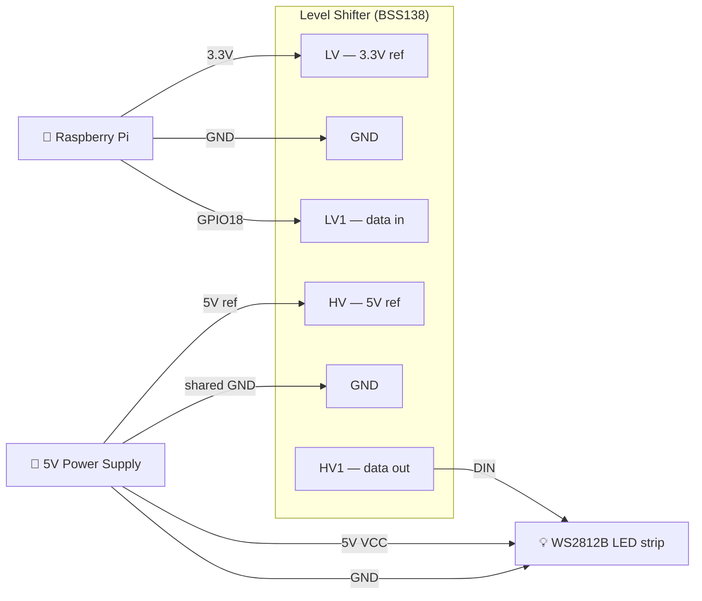

# LED Controller

A Rust web server for controlling WS2812B LED strips (NeoPixels) on a Raspberry Pi. Effects are written in Lua and hot-loaded at startup, transitions between effects are crossfaded, and everything is controllable from a browser.

## Features

- Web control panel: start, stop, next, effect picker with description tooltip, playlist management
- Smooth transitions: fade in on start, fade out on stop, crossfade when switching effects — each with a configurable duration (default 3 s)
- Sub-pixel antialiasing on all moving effects — point sources split brightness between adjacent LEDs for smooth, flicker-free motion
- Frame-rate independent animation — all effects scale by delta time, stable at any CPU load or speed setting
- Gamma correction — perceptual brightness LUT applied at hardware write (configurable exponent, default 2.2)
- Auto-advance: configurable per-effect play time before moving to the next playlist entry
- Full playlist management: add, remove, drag-to-reorder, shuffle; drag works on both desktop and mobile touch
- **48 effects** — all written in Lua, loaded from the `effects/` directory at startup
- Lua effect system — add or edit effects without recompiling; any `.lua` file in `effects/` is registered automatically
- Per-effect descriptions shown in the UI — each effect file declares a `description` string
- Status box shows current effect name, play timer (updated every second), and achieved FPS (updated every 5 s)
- Graceful shutdown — SIGINT/SIGTERM triggers a 500 ms fade to black before exiting
- Persistent state — playlist, speed, brightness, gamma, color order, and all durations are saved to `led-state.json` and restored on restart
- Hardware settings configurable live from the web UI: GPIO pin, pixel count, color order, gamma
- WebSocket push — UI updates within one frame (~16 ms) on any state change; reconnects automatically
- Mobile-friendly UI — 44 px touch targets, pointer-event drag-to-reorder, always-visible controls on touch devices
- `NullPixels` dev mode (no hardware required) with debug logging
- Single binary deployment — Lua VM is vendored; no runtime dependencies on the target beyond the binary and the `effects/` directory

## Changelog

**Current**
- 48 effects, all running as Lua scripts loaded from `effects/` at startup
- Lua effect system: hot-load effects without recompiling; each file exports `name`, `description`, `init(n)`, and `update(buf, dt)`
- Per-effect description shown below the effect selector in the web UI
- Status box: live play timer (resets on effect change) and FPS counter
- Graceful shutdown: SIGINT/SIGTERM fades the strip to black over 500 ms before the process exits
- Emoji icons for all 48 effects in the web UI

**v0.2**
- Periodic FPS log every 5 seconds at `info` level showing actual achieved frame rate
- Speed slider range extended to 10×
- WebSocket push replaces 500 ms polling — UI updates within one frame on any state change, with auto-reconnect
- Mobile-friendly UI — 44 px touch targets, pointer-event drag-to-reorder (works on touchscreens), always-visible remove buttons on touch devices
- Persist UI state (playlist, speed, brightness, gamma, color order, durations) across restarts via `led-state.json`
- GPIO pin, pixel count, color order, and gamma configurable live from the web UI
- Sub-pixel antialiasing on moving effects (Chase, Cylon, KITT, Meteor, Bouncing Balls) — point sources split brightness between adjacent LEDs
- Frame-rate independent decay — trail fades scale by delta time, stable at any speed setting
- Gamma correction LUT applied at hardware write (default 2.2, configurable)
- Software brightness slider (0–100%)
- Effect speed slider (0.1×–10.0×)
- Chase effect randomises colour on each lap
- Playlist loops back to index 0 at end
- Color channel order configurable via `--color-order` flag and web UI

**v0.1**
- Axum web server with REST API
- 23 built-in effects, each running in its own OS thread
- Smooth fade-in / fade-out / crossfade transitions with configurable durations
- Playlist management: add, remove, drag-to-reorder, shuffle, auto-advance
- `NullPixels` dev mode, cross-compilation via `build-pi.sh`

## Hardware

- Raspberry Pi (any model with GPIO)
- WS2812B / NeoPixel LED strip connected to **GPIO 18** (PWM0) by default
- The `rpi_ws281x` C library must be installed on the Pi:



```bash
sudo apt install -y build-essential cmake libclang-dev
git clone https://github.com/jgarff/rpi_ws281x
cd rpi_ws281x && mkdir build && cd build
cmake -D BUILD_SHARED=OFF -D BUILD_TEST=OFF ..
cmake --build .
sudo make install
```

## Running

### Development (no hardware)

```bash
cargo run
```

The server starts on `http://localhost:3000`. Pixel output is logged at `DEBUG` level, showing the first 6 pixel colors as hex on each frame:

```bash
RUST_LOG=led_controller=debug cargo run
```

### Cross-compiling for the Raspberry Pi

Use `build-pi.sh`, which wraps [`cross`](https://github.com/cross-rs/cross) (Docker-based cross compilation). `cross` handles the C toolchain needed for the `hardware` feature automatically.

**Prerequisites:**

```bash
cargo install cross
# Docker must be installed and running
```

**Build and deploy in one step:**

```bash
./build-pi.sh --deploy pi@raspberrypi.local
```

**Pass app flags through with `--`:**

```bash
./build-pi.sh --deploy pi@raspberrypi.local -- --pixels 144 --brightness 80
```

**Build only:**

```bash
./build-pi.sh
# binary at target/aarch64-unknown-linux-gnu/release/led-controller
```

**32-bit Raspberry Pi OS (Pi 2/3/4 running 32-bit):**

```bash
./build-pi.sh --target armv7-unknown-linux-gnueabihf --deploy pi@raspberrypi.local
```

**Dev build (NullPixels, no C library dependency):**

```bash
./build-pi.sh --no-hardware --deploy pi@raspberrypi.local
```

Script flags (before `--`):

| Flag | Default | Description |
|---|---|---|
| `--target <triple>` | `aarch64-unknown-linux-gnu` | Rust target triple |
| `--no-hardware` | off | Build without the hardware feature (NullPixels) |
| `--deploy user@host` | — | SCP the binary to the Pi after building |

### On the Raspberry Pi

Once the binary and the `effects/` directory are deployed:

```bash
sudo ~/led-controller
```

`sudo` is required for GPIO/DMA access. The server listens on `0.0.0.0:3000` — open `http://<pi-ip>:3000` from any device on the network.

The `effects/` directory must be present in the working directory (or pass `--effects-dir` to specify a different path).

### Running as a systemd service

```ini
# /etc/systemd/system/leds.service
[Unit]
Description=LED Controller
After=network.target

[Service]
ExecStart=/home/pi/led-controller
WorkingDirectory=/home/pi
Restart=on-failure
User=root

[Install]
WantedBy=multi-user.target
```

```bash
sudo systemctl enable --now leds
```

State is written to `led-state.json` in `WorkingDirectory`, so the strip resumes exactly where it left off after a reboot or service restart. Copy the `effects/` directory alongside the binary.

## Configuration

Options are set via command-line flags. Most have saved-state equivalents — if the flag is omitted, the value from the last run is used. Explicit CLI flags always override saved state.

```
Usage: led-controller [OPTIONS]

Options:
      --pixels <PIXELS>                      Number of LEDs in the strip [default: 60, or saved]
      --gpio-pin <GPIO_PIN>                  GPIO pin number (hardware only) [default: 18, or saved]
      --brightness <BRIGHTNESS>              Hardware PWM brightness 0–255 [default: 25]
      --port <PORT>                          Port to listen on [default: 3000]
      --state-file <STATE_FILE>              Path to persist state across restarts [default: led-state.json]
      --fade-in-ms <FADE_IN_MS>              Fade-in duration in milliseconds [default: 3000, or saved]
      --fade-out-ms <FADE_OUT_MS>            Fade-out duration in milliseconds [default: 3000, or saved]
      --crossfade-ms <CROSSFADE_MS>          Crossfade duration in milliseconds [default: 3000, or saved]
      --effect-duration-ms <MS>             Time per effect before auto-advancing (0 = infinite) [default: 0, or saved]
      --color-order <COLOR_ORDER>            Physical color channel order (e.g. rgb, grb, bgr) [default: rgb, or saved]
      --speed <SPEED>                        Effect speed multiplier [default: 1.0, or saved]
      --brightness-scale <BRIGHTNESS_SCALE>  Software brightness scale 0.0–1.0 [default: 1.0, or saved]
      --gamma <GAMMA>                        Gamma correction exponent [default: 2.2, or saved]
      --effects-dir <EFFECTS_DIR>            Directory to scan for Lua effect scripts [default: effects]
  -h, --help                                 Print help
```

Example — 144-pixel strip on GPIO 12, 30 s per effect:

```bash
sudo ./led-controller --pixels 144 --gpio-pin 12 --brightness 80 --effect-duration-ms 30000
```

All settings (except `--brightness`, `--port`, and `--state-file`) can also be changed live from the web UI and are persisted automatically.

## State persistence

UI state is saved to `led-state.json` (or the path given by `--state-file`) whenever it changes. On restart the saved values are loaded automatically. The file is plain JSON and can be edited by hand.

What is persisted: playlist order and position, speed, software brightness, gamma, color order, all fade/transition durations, effect duration, GPIO pin, pixel count, and whether the strip was running.

Explicit CLI flags always override saved values for that session, but subsequent web UI changes will be saved over them.

## Web UI

Open `http://<pi-ip>:3000` in a browser.

| Section | Controls |
|---|---|
| **Status** | Coloured dot (green = running, amber = transitioning, grey = stopped) + current effect name + play timer + FPS |
| **Controls** | Start, Next, Stop |
| **Select Effect** | Dropdown of all registered effects with description tooltip + Play button to jump to it immediately |
| **Playlist** | Ordered list of effects to cycle through. Drag `⠿` to reorder, click `✕` to remove, click effect name to play it. Dropdown + **Add** to append any effect. **Shuffle** to randomise order. |
| **Speed** | Multiplier applied to every effect's time delta (0.1× – 10.0×, live) |
| **Brightness** | Software brightness scale applied to all pixel output (0–100%, live) |
| **Effect Duration** | How long each effect plays before auto-advancing (0 = manual only) |
| **Transition Durations** | Separate sliders for fade-in, crossfade, and fade-out |
| **Hardware Settings** | Color order (live), gamma (live), LED count and GPIO pin (apply button — reinitializes hardware) |

## Effects

All 68 effects are Lua scripts in the `effects/` directory.

| Effect | Description |
|---|---|
| 🌌 Aurora | Four overlapping sine-wave bands of green, teal, blue, and purple shimmer at independent speeds |
| 🧩 Cellular Automata | Rule 30 cellular automaton; complex patterns emerge each generation from a simple 3-cell neighborhood rule |
| 🦑 Bioluminescence | Deep ocean darkness with expanding blue-green pulses, like disturbed bioluminescent plankton |
| 🎱 Bouncing Balls | Three balls (red, green, blue) bounce under simulated gravity with energy loss on each bounce |
| 🫁 Breathing | All pixels pulse in and out on a slow breathing rhythm using a sin² envelope |
| 🕯️ Candlelight | Warm orange flicker: each pixel drifts toward a random brightness target, with occasional sharp gusts |
| 💨 Chase | Antialiased comet with a tail proportional to strip length; picks a new random color each lap |
| 🎄 Christmas | Alternating red and green bands with a slow white twinkle overlay |
| 🌀 Color Cycle | The whole strip slowly cycles through one solid hue at a time |
| 🟦 Color Wipe Blue | Fills the strip blue one pixel at a time from one end, then clears it the same way |
| 🟩 Color Wipe Green | Fills the strip green one pixel at a time from one end, then clears it the same way |
| 🟥 Color Wipe Red | Fills the strip red one pixel at a time from one end, then clears it the same way |
| 🌠 Comets | Three comets of different colors chase each other around the strip at different speeds |
| 🎊 Confetti | Saturated random-hue dots scatter onto a slowly decaying background |
| 👁️ Cylon | Red Larson-scanner eye bounces back and forth with exponential brightness falloff on either side |
| 🧬 DNA Helix | Two interlocked sine waves in cyan and orange scroll along the strip like a DNA double helix |
| 🎲 Domino | A tap at one end triggers a chain reaction that cascades to the other end, each pixel tipping the next |
| 💧 Drip | Colored drops spawn at one end, accelerate under gravity, and splat at the other end |
| 🔥 Fire | Heat-diffusion simulation: base glows hot, heat rises through a black→red→yellow→white palette |
| 🐣 Easter | Soft pastel mint, lavender, peach, sky blue, and rose pink breathe gently across the strip |
| 🪲 Fireflies | Dim drifting dots that randomly glow bright then fade, like fireflies on a summer night |
| 💥 Fireworks | Rockets launch from the base, reach an apex, and burst into colorful fragments |
| 🔭 Galaxy | Soft drifting nebula of blues and purples with occasional bright star flares |
| 🍿 Popcorn | Pixels pop bright then fade; spawn rate ramps up in waves like corn popping |
| 🌅 Gradient Cycle | Smooth gradient between two complementary colors that slowly scrolls across the strip |
| 🎃 Halloween Eyes | A pair of red eyes appears at a random position, holds, fades out, then reappears elsewhere |
| 💓 Heartbeat | A red lub-dub double pulse at 72 BPM with a long dark pause between beats |
| 🤹 Juggle | Six differently-colored dots bounce at staggered speeds; their fading trails overlap and blend |
| 🚗 KITT | Twin red eyes start at center, expand outward to the ends, then contract back together |
| 🌋 Lava Lamp | Slow warm blobs drift through a dim red background, like a lava lamp |
| 🌩️ Lightning | Random white strikes flare across the strip, then fade into a flickering blue-white afterglow |
| ☄️ Meteor Rain | White meteor streaks across the strip leaving a randomly-decaying trail, then resets |
| 📡 Morse Code | Flashes "SOS" in International Morse Code on a repeating loop |
| 💡 Neon Sign | Pink neon glow with realistic fluorescent tube flicker, buzz, and occasional dropout |
| 🫧 Oil Slick | Dark iridescent rainbow sheen slowly shifts across the strip like light on spilled oil |
| 🌊 Pacifica | Three-layer ocean wave simulation in deep blue-green, inspired by FastLED's Pacifica |
| ⏳ Pendulum | A glowing dot swings with realistic pendulum physics, slowing at each end |
| 🔮 Plasma | Four sine waves at different spatial and temporal frequencies combine into a shifting color interference pattern |
| 🚨 Police Lights | Alternating red/blue half-strip strobes with a brief white center flash between each side |
| 🏓 Pong | A bright dot bounces between the two ends, getting faster with each hit |
| 🧪 Reaction Diffusion | Gray-Scott activator-inhibitor model; organic Turing stripe patterns emerge from chemistry |
| 🏳️‍🌈 Pride | Six-color pride flag mapped across the strip and slowly scrolling |
| 🌈 Rainbow | Colorwheel hue shifts pixel-to-pixel across the strip, cycling through all colors continuously |
| 🎆 Random Fade | Sparks of random color ignite at random positions, ramp up to peak brightness, then fade out |
| 🎨 Random Twinkle | Ten random-colored pixels reposition randomly every 100 ms |
| 💦 Ripple | Random tap points send expanding rings of light that fade as they travel outward |
| 🏃 Running Lights | Red sine-wave brightness ripples continuously down the strip |
| 🌿 Running Lights Green | Green sine-wave brightness ripples continuously down the strip |
| 🏖️ Sand | Sandy particles settle under gravity, then scatter with a periodic shake |
| 🎇 Sparkler | A drifting source continuously throws fast short-lived sparks in both directions |
| 〰️ Sinelon | A single dot rides a sine wave back and forth leaving a fading trail |
| ❄️ Snow Sparkle | Dim white background with a single bright sparkle that jumps to a new position every 200 ms |
| 🔵 Solid Blue | Solid static blue |
| 🟢 Solid Green | Solid static green |
| 🔴 Solid Red | Solid static red |
| ⬜ Solid White | Solid static warm white |
| ✨ Sparkle | Pixels independently ramp to a random peak brightness then fade back to dark |
| ⚡ Strobe | Ten rapid white flashes in a burst followed by a 1-second pause, then repeat |
| 🔴 Strobe Red | Ten rapid red flashes in a burst followed by a 1-second pause, then repeat |
| 🌄 Sunrise | Slow day cycle shifting through night purple, deep red, orange, golden yellow, and back |
| 🎭 Theatre Chase | Every third pixel is lit and steps along the strip in a marching-lights pattern |
| 🎪 Theatre Chase Rainbow | Theatre chase with a different colorwheel hue on each lit pixel, advancing with every step |
| ⭐ Twinkle | Ten white pixels reposition randomly every 100 ms |
| 🌪️ Twister | Multiple overlapping sine waves at different frequencies create shifting interference patterns |
| ⚖️ Tug of War | Red and blue forces push from opposite ends; the boundary oscillates and occasionally surges |
| 📊 VU Meter | Simulated audio level meter with a bouncing bar, green-to-red color gradient, and peak-hold pixel |
| 🫗 Waterfall | A stream of slowly-shifting color flows steadily from one end to the other |
| 🐛 Worm | A glowing segmented worm crawls the strip; speed variation makes the body snake and bunch |

## Lua effect API

Each `.lua` file in `effects/` is auto-discovered at startup. A file must define:

```lua
name        = "My Effect"          -- display name in UI
description = "One-line summary"   -- shown below the effect picker

function init(n)       -- called once; n = pixel count
    -- set up local state here
end

function update(buf, dt)  -- called every frame; dt = seconds since last frame
    -- write pixels, return true to keep running
    return true
end
```

### Buffer methods

| Method | Description |
|---|---|
| `buf:len()` | Number of pixels |
| `buf:set(i, r, g, b)` | Set pixel `i` (0-based) to exact RGB |
| `buf:get(i)` → `r, g, b` | Read current pixel value |
| `buf:clear()` | Set all pixels to black |
| `buf:plot(pos, r, g, b, alpha)` | Sub-pixel antialiased write at fractional position (wraps via `rem_euclid`) |
| `buf:fade(per_second, dt)` | Multiply all pixels by `per_second ^ dt` — frame-rate-independent trail decay |

`buf:plot` splits brightness between the two adjacent integer pixels by the fractional part, giving smooth motion without pixel-level jitter. `buf:fade` keeps trail lengths consistent regardless of frame rate or speed setting — use `0.85^60` to mean "decay to 85% at 60 fps per frame".

### Adding an effect

1. Create `effects/my_effect.lua` with the template above.
2. Restart the server (or redeploy the `effects/` directory).

The effect appears in the web UI dropdown automatically. No Rust code changes needed.

## API

### `GET /ws` — WebSocket

Upgrades to a WebSocket connection. The server immediately sends the current state as a JSON text frame, then pushes an updated frame whenever any field changes (within one run-loop frame, ~16 ms). The connection is read-only — the server ignores any frames sent by the client.

Reconnect automatically on close; the server resends the full current state on each new connection.

### `GET /api/state`

```json
{
  "is_running": true,
  "current_effect": "Rainbow",
  "transition": "crossfading",
  "playlist": ["Rainbow", "Fire", "Meteor Rain"],
  "playlist_index": 1,
  "effects": ["Rainbow", "Random Fade", "Chase", "..."],
  "effect_descriptions": { "Rainbow": "Full-strip colour wheel sweep", "..." : "..." },
  "effect_elapsed_secs": 42,
  "fps": 59.8,
  "fade_in_ms": 3000,
  "fade_out_ms": 3000,
  "crossfade_ms": 3000,
  "effect_duration_ms": 30000,
  "speed": 1.0,
  "brightness": 1.0,
  "gamma": 2.2,
  "num_pixels": 60,
  "gpio_pin": 18,
  "color_order": "rgb"
}
```

`transition` is `"fading_in"`, `"fading_out"`, `"crossfading"`, or `null`.

### `POST /api/command`

```json
{ "action": "<action>", "effect": "<name>", "value_ms": 2000, "value": 1.5, "index": 0, "to_index": 3 }
```

| Action | Extra fields | Description |
|---|---|---|
| `start` | — | Start / resume from current playlist position |
| `stop` | — | Fade out and stop |
| `next` | — | Crossfade to the next effect in the playlist |
| `select` | `effect` | Crossfade to a named effect |
| `randomize` | — | Shuffle the playlist and restart from position 0 |
| `add_to_playlist` | `effect` | Append a named effect to the playlist |
| `remove_from_playlist` | `index` | Remove the effect at the given playlist position |
| `move_in_playlist` | `index`, `to_index` | Move a playlist item to a new position |
| `set_fade_in` | `value_ms` | Set fade-in duration |
| `set_fade_out` | `value_ms` | Set fade-out duration |
| `set_crossfade` | `value_ms` | Set crossfade duration |
| `set_effect_duration` | `value_ms` | Set per-effect play time (0 = infinite) |
| `set_speed` | `value` | Set speed multiplier (float, 0.1–10.0) |
| `set_brightness` | `value` | Set software brightness scale (float, 0.0–1.0) |
| `set_gamma` | `value` | Set gamma correction exponent (float, 1.0–4.0) |
| `set_color_order` | `effect` | Set physical channel order string (e.g. `"grb"`) |
| `set_num_pixels` | `value_ms` | Reinitialize with a new pixel count |
| `set_gpio_pin` | `value_ms` | Reinitialize hardware on a different GPIO pin |

## Project structure

```
src/
├── main.rs              entry point — CLI flags, Axum server, graceful shutdown
├── pixels.rs            PixelStrip trait, NullPixels (dev), NeoPixelStrip (hardware), gamma LUT
├── runner.rs            effect thread management, fade/crossfade state machine, playlist,
│                        persistent state, hardware reinit factories
├── api.rs               Axum route handlers
└── effects/
    ├── mod.rs           Effect trait, EffectRegistry (with Lua auto-load), LuaBuf helpers
    └── lua_effect.rs    LuaEffect wrapper — Lua VM per effect, probe_metadata
effects/                 48 Lua effect scripts (auto-discovered at startup)
static/
├── index.html           control panel (embedded in binary via include_str!)
└── app.js               frontend JS (embedded in binary via include_str!)
led-state.json           persisted UI state (created automatically on first run)
```

## Roadmap / ideas

### UI / usability
- **Saved presets** — name and store a (effect + speed + brightness + duration) configuration to recall later
- **Dimming schedule** — automatically dim or turn off at a configured time (e.g. midnight), useful for permanent installs
- **Basic auth** — single username/password so the UI is not open to everyone on the local network

### Effects
- **Audio reactive** — sample a USB mic/dongle and drive brightness or color from beat detection or amplitude
- **Custom color picker** — choose the color for solid/wipe/chase effects from the UI without editing code
- **Per-effect color palette** — let effects draw from a user-chosen set of colors rather than hard-coded values
- **Segmented effects** — run different effects on different sections of the strip simultaneously

## Transition behavior

| Situation | Result |
|---|---|
| Start from stopped | Fade in from black over `fade_in_ms` |
| Stop while running | Fade out to black over `fade_out_ms` |
| Switch effects while running | Both effect threads run simultaneously; buffers are per-pixel lerped over `crossfade_ms` |
| Switch again mid-crossfade | Outgoing effect dropped; new effect crossfades from the current blended frame |
| Stop mid-crossfade | Incoming effect fades out from its current blend position |
| Effect duration expires | Auto-crossfade to next playlist entry; timer resets when effect reaches full Running state |
| Playlist reaches end | Wraps back to index 0 |
| GPIO pin or pixel count changed | Current effect stops, hardware reinitializes, effect restarts with new settings |
| SIGINT / SIGTERM received | Strip fades to black over 500 ms, then process exits cleanly |
